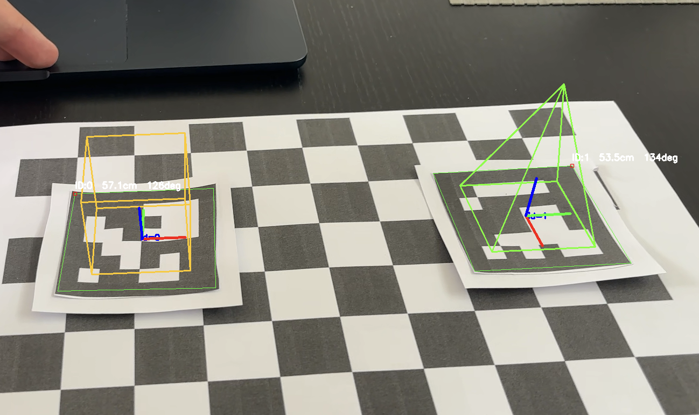

# VARM — P2: Marker Based Augmented Reality

Aplicação de AR baseada em marcadores ArUco com OpenCV/Python.



## Dependências

```bash
pip install opencv-contrib-python==4.9.0.80 numpy==1.26.4
```

> Usar `opencv-contrib-python` (não `opencv-python`) para ter acesso ao módulo `cv2.aruco`.

---

## Como correr

### 1. Calibrar a câmara

```bash
python calibrate.py
```

Controlos: `SPACE` captura frame · `c` calibra e guarda · `q` sai

Gera `camera_calibration.npz` com os parâmetros intrínsecos da câmara.

Para verificar o resultado (mostra feed original vs sem distorção):

```bash
python calibrate.py --check
```

### 2. Testar deteção ArUco (opcional)

```bash
python aruco_detector.py
```

Mostra o feed da câmara com eixos de pose desenhados sobre cada marcador detetado.

### 3. Aplicação AR principal

```bash
python main.py
```

Sobrepõe objetos 3D wireframe sobre os marcadores detetados:

| ID | Objeto |
|----|--------|
| 0  | Cubo (ciano) |
| 1  | Pirâmide (verde) |
| outro | Eixos XYZ |

---

## ⚠️ Passos manuais pendentes (fazer antes de correr pela primeira vez)

O código está completo mas é necessário preparar o material físico antes de executar.

### A. Imprimir o tabuleiro de xadrez para calibração

- Usar um tabuleiro com **9×6 cantos internos** (10×7 quadrados)
- Imprimir em A4 e colar numa superfície rígida plana (cartão, pasta)
- Medir o tamanho real de um quadrado em metros e atualizar `SQUARE_SIZE` em `calibrate.py`
  - Default: `0.025` (2.5 cm) — ajustar conforme a impressão
- Tabuleiro de exemplo: https://docs.opencv.org/master/pattern.png

### B. Gerar e imprimir os marcadores ArUco

- Aceder a https://chev.me/arucogen/
- Selecionar dicionário **6x6 (250)** e gerar pelo menos os IDs **0** e **1**
- Tamanho sugerido: 5–8 cm de lado
- Após imprimir, medir o lado real e atualizar `MARKER_SIZE` em `aruco_detector.py` e `main.py`
  - Default: `0.05` (5 cm) — ajustar conforme a impressão

### C. Tirar as fotos de calibração

- Com o tabuleiro impresso e a webcam ligada, correr `python calibrate.py`
- Capturar **mínimo 10 frames** com o tabuleiro em posições, ângulos e distâncias variados
- O erro de reprojeção (RMS) ideal é abaixo de **1.0 px**

---

## Como funciona o código

### Fluxo geral

```
calibrate.py
  → captura fotos do chessboard
  → calibrateCamera()
  → guarda camera_calibration.npz

main.py (cada frame):
  webcam → gray
         → detectMarkers()                                              → corners, ids
         → estimatePoseSingleMarkers(corners, MARKER_SIZE, mtx, dist)  → rvec, tvec
         → projectPoints(vertices_3D, rvec, tvec, mtx, dist)           → pixels_2D
         → cv2.line() por cada aresta                                   → objeto na imagem
```

A chave conceptual é: **a calibração transforma a câmara num instrumento de medição**. Sem ela, o `estimatePoseSingleMarkers` não consegue calcular distâncias reais nem orientações corretas, e os objetos não ficam alinhados com o marcador.

---

### `calibrate.py`

**`objp`** — grelha de 54 pontos 3D no plano Z=0 com coordenadas reais (em metros). São as posições conhecidas dos cantos do tabuleiro no mundo físico.

**`capture_mode()`** — cada frame converte para cinzento e chama `findChessboardCorners`. Se encontrar os 54 cantos, ao premir `SPACE` refina-os com `cornerSubPix` (precisão subpixel) e guarda o par: pontos 3D reais ↔ pixels 2D na imagem.

**`_run_calibration()`** — com N pares (3D→2D), `calibrateCamera` resolve o sistema e devolve:
- **`mtx`** — matriz intrínseca K com `fx`, `fy` (distâncias focais) e `cx`, `cy` (centro óptico)
- **`dist`** — 5 coeficientes de distorção radial/tangencial
- **`rms`** — erro médio de reprojeção em píxeis (bom abaixo de 1.0 px)

**`check_mode()`** — mostra original vs `undistort()` lado a lado para verificar visualmente.

---

### `aruco_detector.py`

```python
aruco_dict = cv2.aruco.getPredefinedDictionary(cv2.aruco.DICT_6X6_250)
detector   = cv2.aruco.ArucoDetector(aruco_dict, DetectorParameters())
corners, ids, _ = detector.detectMarkers(gray)
rvecs, tvecs, _ = cv2.aruco.estimatePoseSingleMarkers(corners, MARKER_SIZE, mtx, dist)
```

`DICT_6X6_250` = dicionário com 250 marcadores possíveis, cada um codificado numa grelha 6×6 de bits.

Para cada marcador detetado:
- **`rvec`** — vetor de rotação de Rodrigues (direção = eixo de rotação, magnitude = ângulo)
- **`tvec`** — posição do centro do marcador em metros no referencial da câmara `[x, y, z]`
- `np.linalg.norm(tvec)` = distância euclidiana da câmara ao marcador

`drawFrameAxes` desenha os eixos XYZ sobre o marcador para visualizar a orientação.

---

### `main.py`

Os objetos são definidos como vértices no **espaço do marcador** (Z=0 = plano do marcador, Z cresce para cima) e arestas entre eles:

```python
# Cubo: 4 vértices base (Z=0) + 4 vértices topo (Z=h)
# Pirâmide: 4 vértices base + 1 ápice em (0, 0, h)
```

**`draw_object()`** — usa `projectPoints` para transformar os vértices 3D em píxeis 2D:

```python
projected, _ = cv2.projectPoints(vertices, rvec, tvec, mtx, dist)
```

Isto aplica a transformação completa: espaço do marcador → espaço da câmara (via `rvec`/`tvec`) → plano da imagem (via `mtx`) → correção de distorção (via `dist`). Depois liga os vértices com `cv2.line`.

O objeto "segue" o marcador porque `rvec`/`tvec` são recalculados a cada frame — se moves a câmara ou o marcador, a projeção atualiza automaticamente.

**`OBJECTS` dict** — mapeia ID → função construtora do objeto. Para adicionar um novo objeto basta criar a função e registá-la:

```python
OBJECTS = {0: _cube_edges, 1: _pyramid_edges, 2: _nova_funcao}
```

---

## Estrutura do projeto

```
p2/
├── calibrate.py            # calibração da câmara com chessboard
├── aruco_detector.py       # deteção ArUco + estimação de pose
├── main.py                 # aplicação AR principal
├── camera_calibration.npz  # gerado após calibrar (não commitar)
└── README.md
```

---

## Problemas encontrados e lições aprendidas

### Deteção ArUco — borda branca obrigatória

Os marcadores impressos não tinham margem branca à volta. O algoritmo de deteção procura a transição preto→branco na borda exterior do marcador para identificar os quadrados negros — sem essa transição, simplesmente não deteta nada (sem erro, sem aviso).

**Solução:** colar o marcador num papel/cartão branco com pelo menos 1–2 cm de margem em todos os lados, ou reimprimir com margem suficiente.

---

### Calibração — a rigidez do tabuleiro é crítica

A calibração exige imagens do tabuleiro em posições, distâncias e ângulos variados. Ao longo do processo testámos três abordagens, com resultados muito diferentes:

**1.ª tentativa — só rotação a 90° face à câmara**
Manter o tabuleiro sempre perpendicular à câmara e apenas rodar o plano não dá variedade angular suficiente. O algoritmo não consegue estimar bem os parâmetros de distorção radial porque todos os pontos ficam numa zona estreita da imagem. RMS elevado e instável.

**2.ª tentativa — papel sem suporte rígido**
Tentar vários ângulos com o papel solto faz com que o papel curve ligeiramente. Os cantos do tabuleiro ficam num plano ligeiramente curvo em vez de plano — o `calibrateCamera` assume que Z=0 para todos os pontos, por isso qualquer curvatura do papel introduz erro sistemático. O RMS ficou alto (>9 px em alguns casos).

**3.ª tentativa — tabuleiro colado em superfície rígida (resultado final)**
Colar o papel numa superfície dura (pasta, cartão espesso) garante que os cantos ficam rigorosamente no mesmo plano. Com 67 frames capturadas em ângulos, distâncias e inclinações variados, obtivemos RMS = 2.41 px — o melhor resultado da sessão.

**Conclusão:** a rigidez do suporte é tão importante quanto a variedade de ângulos. Um tabuleiro que curve mesmo ligeiramente degrada significativamente a calibração.
